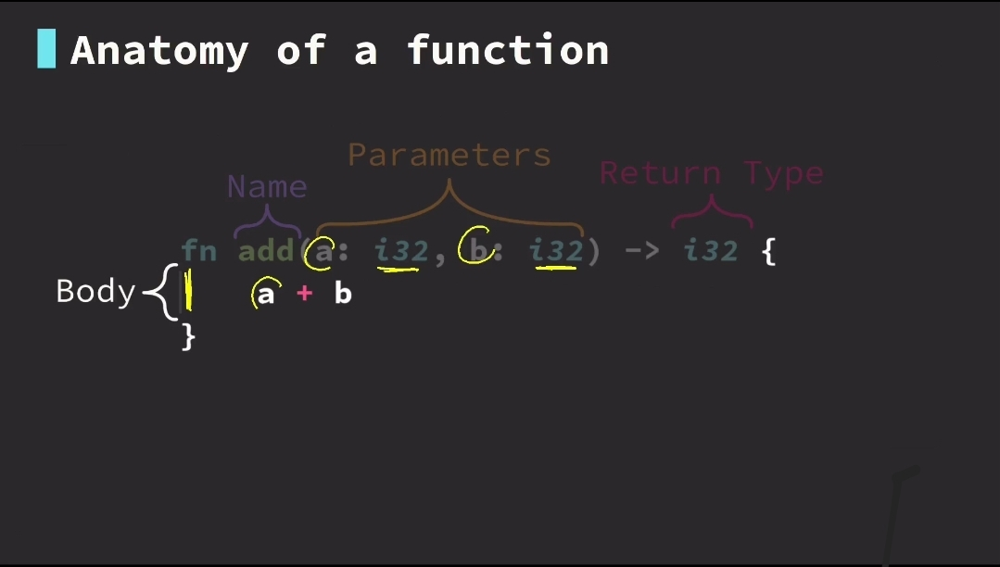
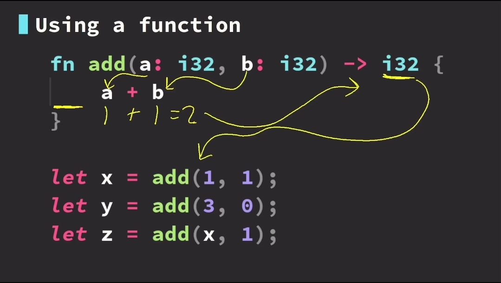

# Rust Fundamentals

## Basic Data Types

Anthing can be represented with binary

- Boolean - `true` and `false`
- Integer - `1`, `2`, `-10`
- Double or Float - `4.5` `-12.5`, `3.14`
- Character - `'c'`, `'C'`, `'6'`, `'$'`
- String - `"Hello world"`,

#### Integer Types

- Signed integers:
  - 8-bit `i8`
  - 16-bit `i16`
  - 32-bit `i32`
  - 64-bit `i64`
  - 128-bit `i128`
  - arch `isize`

* UnSinged integers:

  - 8-bit `u8`
  - 16-bit `u16`
  - 32-bit `u32`
  - 64-bit `u64`
  - 128-bit `u128`
  - arch `usize`

  #### Floating point

  - `f32`
  - `f64` **default** (capable of more precision)

  #### Integer Literals

  - Decimal `98_222`
  - Hex `0xff`
  - Octal `0o77`
  - Byte (u8 only) `0b1011_0100`
  - Binary `b'A'`

## Variables

Variables are a way to assign data to a temporary memory location. Variables can be set to any value or type.
Variables in rust are **immutable** by default, but can be mutable. Variables makes it easy to work with data.

we use the `let` keyword to define a variable in rust.
To declare that a variable should be mutable we use the `mut` keyword.

```rs
let two = 2;
let name = "Joshua";
let mut salary = 25; // this means the variable is mutable
let your_name = name;
```

**NB**: every line must end with a semicolon `:`

## Functions

Functions are a way to encapsulate program functionality.

### Anatomy of a function

```rs
    fn add(a: i32, b: i32) -> {
        a + b
    }
```



### Calling a function

```rs
    let x = add(1,1);
    let y = add(x, 8);
```



### The Println Macro

What exactly is a Macro? - A macro is essentially a piece of code that you can define once and reuse multiple times with different inputs.

`println!` macro prints information to the terminal. This is useful for debugging. The `!` tells rust we are using a macro and not a function.
To supply a variable data to the `println` macro we use the `{}`

```rs
    let life = 42;
    println!("Hello");
    println!("{:?}", life); //debug print
    println!("{life:?}");
    println!("{life}");
```

## Control Flow

Code is executed line by line. When actions are performed control flow may change. Specific conditions can change control flow such as `if`, `else` `else if`
